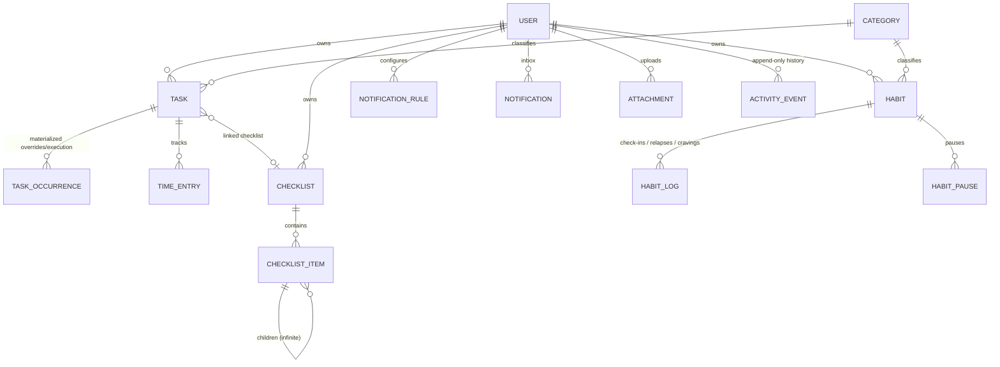
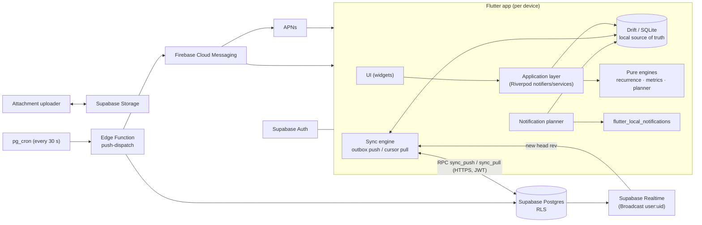

# Everslot — Architecture

> Status: **v1 (pre-build)** · Owner: project lead · Last updated: 2026-09-22
> This document is normative. Code follows it; changes to it are recorded in §13 *Decision log*.

---

## 0. TL;DR

- **Client:** Flutter (iOS + Android first) · Riverpod 3 (codegen) · go_router · Drift (SQLite) as the
  **local source of truth** · freezed models · fl_chart + custom painters · flutter_local_notifications.
- **Backend:** Supabase — Postgres (RLS on every table), Auth, Storage, Realtime, Edge Functions (Deno),
  pg_cron + pg_net. **Push:** Firebase Cloud Messaging (HTTP v1) → APNs / Android.
- **Offline-first:** every write goes to Drift + an outbox of per-field patches; a custom **sync engine**
  pushes patches (per-field last-writer-wins with hybrid logical clocks) and pulls row changes with a
  gap-free per-user revision cursor; a private Realtime Broadcast only *nudges* a pull.
- **Pure-Dart engines** (in `packages/`): `everslot_recurrence` (free recurrence rules) and
  `everslot_metrics` (stats math). Deterministic, exhaustively unit-tested, UI-free.
- **Notifications:** *plan on device, dispatch on server.* The device expands rules into concrete
  notifications, schedules the soonest locally (within OS limits) and uploads them as jobs; a server
  dispatcher (pg_cron → Edge Function) writes the in-app inbox and sends FCM pushes to any device
  that is not covering that notification locally. Deterministic dedupe keys everywhere.
- **Stats:** computed on device from the local DB (fast, offline, private), in background isolates.

---

## 1. Product & domain overview

| Section | User-facing name | What it does |
|---|---|---|
| Planner | **Plan** | Tasks placed in time. Default **Week Table** (7 day columns × time-slot rows, slot = 1 min … 24 h), **Day List**, plus many more views (month, agenda, timeline, kanban, focus…). Tasks can recur with fully free rules. |
| Checklists | **Lists** | Keep-like cards. Each card has optional note text and infinitely nested items. Items carry text + images/files and a status: todo, ongoing, waiting (reason), blocked (reason), completed, cancelled. Preview/run mode to tick through. |
| Habits | **Habits** | *Build* habits (yes/no, count, duration, numeric, limit) on any schedule; daily check-ins (done / not done / partial / skip / excuse). *Quit* trackers (stop smoking…): clean-time counter, relapses, cravings, money/time saved, milestones. |
| Stats | **Insights** | Super-detailed metrics per item and per section, cross-section dashboard, reports. |
| Notifications | **Inbox** + per-item rules | Fully configurable reminders for every item type: in-app inbox/banners, local notifications, FCM push. |
| Cross-cutting | Today, Search, Settings | Aggregated Today screen, global search, quick-add, widgets, export, privacy. |

**Navigation:** bottom bar `Today · Plan · Lists · Habits · Insights`; top app bar has **Search**,
**Inbox** (badge) and **Profile/Settings**. A contextual **+** creates the item type of the current tab.

**Core domain relationships**



---

## 2. Architecture principles

1. **Local-first UX.** UI reads only from the local DB (reactive Drift streams). Network never blocks
   an interaction. Sync is background plumbing with visible status.
2. **Data isolation by construction.** Every row has `user_id`; Postgres RLS enforces
   `user_id = auth.uid()` on every table and storage path. The app never holds a service key.
3. **Pure engines, thin UI.** Complex logic (recurrence, time-grid layout, tree ops, streaks, metrics,
   notification planning) lives in pure Dart with no Flutter imports → trivially unit-testable.
4. **Time is explicit.** Instants are UTC; wall-clock values are stored with an IANA zone or marked
   *floating*. No naked local `DateTime` crosses a layer boundary (§9.1).
5. **Deterministic identity.** Client-generated UUIDv7 for new rows; UUIDv5 for records that several
   devices may create independently (occurrence records, habit day-state, inbox items) so they converge.
6. **Everything configurable is versioned data.** Recurrence rules, notification rules, view configs and
   settings are JSON value objects with a `"v"` version and forward migrations.
7. **Feature-first modules** with strict layer dependencies (§6.1).
8. **Inclusive by default:** i18n (EN/FR/AR), RTL, dynamic type up to 200 %, screen-reader labels,
   color-blind-safe palettes, reduce-motion.
9. **Measure before optimizing,** but every screen has a performance budget (§9.6).
10. **Docs are part of the code.** Architecture changes land with a decision-log entry.

---

## 3. Tech stack

> Versions verified on **2026-09-22** (pub.dev / registries). Pin them at init (T1.1.x); bump deliberately
> and record changes here. Many packages below require **Dart ≥ 3.13 / Flutter ≥ 3.47** — the local SDK
> (3.38.9) must be upgraded first.

### 3.1 Client (Flutter)

| Concern | Choice (version) | Notes |
|---|---|---|
| SDK | **Flutter 3.47.5 / Dart 3.13.4** pinned via **FVM** (`.fvmrc`) | Min iOS 15, Android API 24, compile/target SDK 36; Java 17, AGP 9.1, Gradle 9.3.1, Kotlin 2.4; iOS uses **Swift Package Manager** (CocoaPods only for plugins that still need it) and the **UIScene lifecycle** (mandatory with Xcode 27). Impeller everywhere. |
| Widgets libraries | `material_ui` 1.4.0 / `cupertino_ui` 1.1.x | Built-in Material/Cupertino copies are frozen (3.44) and deprecated from Nov 2026 → import `package:material_ui/...` in new code (`dart fix --apply --code=migrate_design_widgets`). |
| State / DI | `flutter_riverpod` 3.4.3 + `riverpod_annotation` + `riverpod_generator` 4.0.9; `riverpod_lint` 3.1.9 (analyzer plugin) | Codegen providers only. Riverpod's experimental offline persistence/mutations are **not** used — Drift is the store. User knows Provider → natural successor. |
| Routing | `go_router` 18.0.1 + `go_router_builder` 4.5.0 | Feature-complete (bug-fix only) — stable choice. `StatefulShellRoute.indexedStack` for tabs; typed routes; deep links. |
| Models | `freezed` 4.0.2 (+ `freezed_annotation` 3.1) + `json_serializable` 6.14.1 | Unions/value objects/UI state; Drift generates row classes. json_serializable 6.14 distinguishes missing vs explicit `null` (useful for sync patches). |
| Codegen | `build_runner` 2.16.1 | AOT builders + `--workspace` builds. |
| Local DB | `drift` 2.35.0 + `drift_dev` + `drift_flutter` 0.3.1 + `sqlite3` 3.6.0 | SQLite via build hooks — **do not add `sqlite3_flutter_libs`** (end-of-life). FTS5, window functions, `shareAcrossIsolates`. |
| Backend SDK | `supabase_flutter` 2.17.2 | Stay on 2.x (3.0 is pre-release). |
| Auth | `google_sign_in` 7.2.0; `sign_in_with_apple` 8.2.0 + `crypto` | Native ID-token flows (`signInWithIdToken`); Apple nonce (SHA-256 to Apple, raw to Supabase). |
| Push | `firebase_core` 4.15.0, `firebase_messaging` 16.7.0 | Call `configureNotificationCenterDelegate()` from the AppDelegate (UIScene). |
| Local notifications | `flutter_local_notifications` 22.3.1 + `timezone` 0.11.1 + `flutter_timezone` 5.1.0 | Zoned scheduling, actions incl. text input, background action isolate. |
| Background | `workmanager` 0.10.10 | Best-effort (never used for reminders themselves). |
| Charts | `fl_chart` 1.2.0 + custom `CustomPainter`s (+ optional `graphic` 2.7.0) | Heatmaps, punch card, CFD, Gantt, streak timeline, radial clock are custom. |
| Time grid | Custom engine (§6.9) on Flutter's 2-D scrolling API + `two_dimensional_scrollables` 0.5.4 (`TableView`, pinned header/ruler) | No package covers 1-min…24-h slots, semantic zoom, bucket mode and RTL; `kalender` 0.32 / `infinite_calendar_view` are references only (unstable APIs). |
| Tree | Custom flattened tree on `SliverReorderableList` (reference: `flutter_fancy_tree_view2` 1.6.3) | Original fancy_tree_view discontinued. |
| Media | `image_picker` 1.2.3, `file_picker` 13.1.0, `flutter_image_compress` 2.5.1, `pdfrx` 2.6.5, `InteractiveViewer` (zoom), `share_plus` 13.3.0, `path_provider`, `mime`, `crypto` | `photo_view`/`open_filex` are ageing — avoid new dependencies on them. |
| Resumable uploads | `tusc` 4.0.0 | Supabase Storage TUS (6 MB chunks) — the Supabase Dart SDK has no TUS client. |
| IDs / ordering | `uuid` 4.6.0 (v7 + v5); fractional indexing **vendored** from `fractional_indexing_dart` 1.0.7 (byte-compatible with rocicorp's JS lib) | Vendored + tested (few users upstream). |
| Utilities | `collection`, `intl` 0.20.3, `logging`, `connectivity_plus`, `package_info_plus`, `device_info_plus`, `url_launcher`, `app_links`, `flutter_secure_storage` 11.2.0 | |
| Platform extras | `home_widget` 0.10.0, `quick_actions`, `receive_sharing_intent` 1.9.0, `local_auth` 3.0.2, `in_app_review`, `device_calendar_plus` 0.8.1 (P2), `live_activities` 2.6.0 (P2), `flutter_alarmkit` 0.4.0 (P2) | `device_calendar` is abandoned → `device_calendar_plus`. |
| Rich text (optional) | `flutter_quill` 11.6.0 | Only if markdown-lite proves insufficient (P1 decision in [3.1]). |
| Layout & export | `flutter_staggered_grid_view` (Keep-like masonry board); `pdf` + `printing` (P2 PDF export) | |
| Money math | `decimal` | Exact arithmetic for money saved/spent (never `double`). |
| i18n | `flutter_localizations` + `intl` + gen-l10n (ARB, generated into `lib/`) | EN, FR, AR (RTL). `flutter_gen` synthetic package is deprecated. |
| Crash reporting | `firebase_crashlytics` 5.4.0 | Free; covers iOS/Android. Revisit Sentry if web/desktop ship ([9.3]). |
| Fonts/icons | Bundled Inter + Noto Sans Arabic; `material_symbols_icons` | No runtime font fetching (offline). |
| Testing | `flutter_test`, `mocktail` 1.0.5, `patrol` 4.10.0 (+ `patrol_cli` 4.8.0; tests in `patrol_test/`), `alchemist` 0.14.0, `leak_tracker` | §10. |
| Lints | `very_good_analysis` 11.0.0 + `riverpod_lint` (analyzer `plugins:`) | `custom_lint` is stale → any custom rules are analyzer plugins. |

### 3.2 Backend & services

| Concern | Choice | Notes |
|---|---|---|
| Database | Supabase **Postgres 17** | Migrations via Supabase CLI (2.117+); pgTAP in `supabase/tests/database`. |
| Auth | Supabase Auth | Email OTP/magic link, Google, Apple, anonymous (guest) with linking. **New API keys**: publishable (`sb_publishable_…`) in the app, secret (`sb_secret_…`) server-side only; legacy anon/service_role keys are deprecated by end of 2026. Asymmetric JWT signing. |
| API | PostgREST + **RPC functions** (`app.sync_push`, `app.sync_pull`, …) | All client writes go through sync RPCs. |
| Files | Supabase Storage, private bucket `attachments` | Path-scoped RLS; resumable (TUS) uploads via `<project-ref>.storage.supabase.co`; client-side thumbnails (server image transforms need Pro). Free plan max file size 50 MB. |
| Realtime | **Broadcast from database** on private channel `user:<uid>` | Trigger calls `realtime.send` with the new head revision only; RLS on `realtime.messages`. Data always comes via pull. |
| Server logic | Edge Functions (TypeScript, **Deno 2.1-compatible** hosted runtime) | `npm:`/`jsr:` pinned imports; `jose` 6.x for the FCM service-account JWT; don't commit a Deno lockfile v5 (local Deno 2.9 is newer than the hosted runtime) — test with `supabase functions serve`. Limits: 2 s CPU, 256 MB, 150 s (free) / 400 s (paid) wall clock, `EdgeRuntime.waitUntil` for background work. |
| Scheduling | `pg_cron` (second-level schedules) + `pg_net` (+ Vault for secrets) | ≤ 8 concurrent jobs, ≤ 10 min each; pg_net is fire-and-forget (2 s timeout, no retries). |
| Push | Firebase Cloud Messaging HTTP v1 (service-account OAuth2, token cached ~1 h) | APNs `.p8` key uploaded to Firebase. |
| Plans | Free for development; **Pro** before launch | Free projects pause after 1 week idle; Free: 500 MB DB, 1 GB storage, 5 GB egress, 500k function calls, 200 realtime connections. |

### 3.3 Tooling

FVM · pub workspaces (glob members, one lockfile) + `melos` 8.9 (config in the root `pubspec.yaml`) ·
Supabase CLI (Docker local stack) · Deno (fmt/lint/test for functions) · GitHub Actions CI
(`subosito/flutter-action`, `supabase/setup-cli`) · fastlane 2.240 (or Codemagic) · Firebase CLI + FlutterFire CLI.

---

## 4. System context



---

## 5. Repository layout

```text
/ (repo root)
├── CLAUDE.md
├── README.md
├── .fvmrc                         # pinned Flutter version
├── pubspec.yaml                   # pub workspace root (workspace: [app, packages/*]) + melos scripts
├── analysis_options.yaml
├── docs/                          # architecture + task files
├── app/                           # Flutter application (package: everslot)
│   ├── lib/
│   │   ├── main_dev.dart | main_prod.dart
│   │   ├── bootstrap.dart         # init: env, logging, Firebase, Supabase, Drift, timezone, providers
│   │   ├── app/                   # App widget, router, theme, l10n wiring, shell scaffold
│   │   ├── core/                  # cross-cutting infrastructure
│   │   │   ├── database/          # AppDatabase (Drift), migrations, converters, FTS
│   │   │   ├── sync/              # outbox, push/pull, realtime nudge, sync status
│   │   │   ├── time/              # Clock, zones, LocalDateTime helpers, formatting
│   │   │   ├── ids/               # uuid v7/v5 helpers, namespaces
│   │   │   ├── ordering/          # fractional indexing
│   │   │   ├── attachments/       # pick/compress/upload/cache
│   │   │   ├── notifications/     # platform adapter (local + FCM), permission service
│   │   │   ├── env/ errors/ logging/ platform/ background/
│   │   ├── design_system/         # tokens, theme extensions, components
│   │   ├── features/
│   │   │   ├── auth/ onboarding/ profile/ settings/
│   │   │   ├── today/ search/ quick_add/
│   │   │   ├── organization/      # categories, tags
│   │   │   ├── planner/           # tasks, occurrences, time grid, views
│   │   │   ├── checklists/
│   │   │   ├── habits/            # build + quit
│   │   │   ├── stats/
│   │   │   ├── notifications/     # rules, inbox, planner orchestration
│   │   │   └── widgets_home/      # home-screen widget bridge
│   │   └── l10n/                  # ARB files (app_en.arb, app_fr.arb, app_ar.arb)
│   ├── test/  patrol_test/  integration_test/  test_driver/
│   ├── android/  ios/
│   └── assets/                    # fonts, sounds, milestone content, icons
├── packages/
│   ├── everslot_recurrence/        # pure Dart: rule model, expansion, text, RRULE io
│   └── everslot_metrics/           # pure Dart: streaks, scores, flow metrics, statistics
├── supabase/
│   ├── config.toml
│   ├── migrations/                # YYYYMMDDHHMMSS_description.sql
│   ├── functions/
│   │   ├── _shared/               # fcm client, supabase admin client, auth helpers, types
│   │   ├── push-dispatch/         # cron: claim due jobs → inbox + FCM
│   │   ├── sync-nudge/            # webhook: silent push to stale devices
│   │   └── account-delete/        # user-invoked: purge storage + auth user
│   ├── tests/database/            # pgTAP (*.test.sql)
│   └── seed.sql
├── fixtures/                      # shared JSON test vectors: recurrence/, ids/, stats/, schemas/ (+ SQL-side twins)
└── .github/workflows/             # ci.yml, release.yml
```

---

## 6. Client architecture

### 6.1 Layers & dependency rules

```text
presentation  →  application  →  domain  ←  data
     (widgets,        (services,       (entities,        (Drift tables/DAOs,
      controllers)     providers)       value objects,    Supabase clients,
                                        engines, repo     repository impls,
                                        interfaces)       mappers)
```

- `domain` imports nothing from Flutter, Drift or Supabase. Pure Dart only.
- `data` implements `domain` repository interfaces; it is the only layer touching Drift/Supabase.
- `application` orchestrates repositories + engines; exposes Riverpod providers/notifiers.
- `presentation` never calls repositories directly — only application providers.
- Cross-feature access goes through the other feature's `application` API (never its `data`).
- `core/` may be used by any layer's matching level (e.g. `core/time` is domain-safe; `core/database` is data-only).

### 6.2 Feature module template

```text
features/<feature>/
  domain/        entities/*.dart (freezed) · value_objects/ · services/ (pure) · <x>_repository.dart (abstract)
  data/          tables/*.dart (Drift) · daos/ · mappers/ · <x>_repository_impl.dart
  application/   <x>_service.dart · providers.dart (codegen)
  presentation/  screens/ · widgets/ · controllers/ (Notifiers) · <feature>_routes.dart
```

### 6.3 State management (Riverpod 3)

- Manual Riverpod 3 providers (`Provider`, `StreamProvider`, `NotifierProvider`, `.family`, `.autoDispose`) — no code generation (ADR-016). See `docs/dev_patterns.md`.
- Repositories/services: `keepAlive: true`. Screen controllers: auto-dispose, family by id/date.
- Drift `watch()` streams are exposed as stream providers → UI renders `AsyncValue` with shared
  loading/error widgets.
- Mutations go through notifier methods that call application services; optimistic UI is free
  because the local DB is the source of truth.
- Time is injected (`clockProvider`) — never call `DateTime.now()` in domain/application code.

### 6.4 Navigation & deep links

- `go_router` with typed routes. Shell: `StatefulShellRoute.indexedStack` with 5 branches
  (Today, Plan, Lists, Habits, Insights). Modal routes for editors (full-screen sheets on phones).
- Deep-link scheme `everslot://` (+ universal/app links once a domain exists). Canonical paths:
  `/plan/week?date=2026-09-22`, `/plan/day?date=…`, `/task/:id?occ=<occurrence_key>`,
  `/lists/:checklistId?item=:itemId`, `/habits/:id`, `/insights/:scope/:id`, `/inbox`, `/settings/...`.
- Notification taps and widgets always navigate via these paths (single parser, unit-tested).

### 6.5 Local database (Drift)

- One `AppDatabase` (`core/database`) aggregating tables defined in each feature's `data/tables`.
- Mirrors the server schema (§7.3) for synced tables + **local-only** tables (never synced):
  `sync_outbox`, `sync_state` (§6.6), `local_notification_schedule` (§6.13),
  `ui_node_state` (node_id, checklist_id, collapsed, updated_at),
  `ui_checklist_state` (checklist_id, mode edit|preview, focus_item_id, view_type, sort_json, filter_json,
  scroll_offset, last_opened_at), `ui_view_state` (view id, anchor date, scroll minute, zoom),
  `habit_timer_state` (running duration timers survive app kill), `attachment_cache` (§6.7),
  `search_index` (FTS5), `stats_cache` (optional rollups), `insight_state` (key, fired_at, dismissed_at —
  insight feed de-duplication).
- DateTime stored as ISO-8601 **text in UTC** (`storeDateTimeValuesAsText: true`); wall-clock values
  as ISO text without offset; dates as `YYYY-MM-DD` text.
- Runs on a background isolate (`drift_flutter` `driftDatabase(...)` with isolate) to keep UI jank-free.
- Every schema change: bump `schemaVersion`, write a step migration, export schema JSON
  (`drift_dev schema dump`) and add a migration test (`SchemaVerifier`).
- Repositories write the entity row, the outbox entry and (if relevant) an `activity_events` row in
  **one transaction**.

### 6.6 Sync engine

**Goal:** multi-device, offline-capable, simple enough to reason about and test. Data is single-user (no
collaboration), so each user's writes can be serialized cheaply on the server.

> ⚠ Rules for implementers (AI tools tend to write the naive version): **never** use `updated_at`
> timestamps or a global sequence as the pull cursor (values are assigned before commit and commits land
> out of order → devices silently skip rows). Use the per-user revision counter below.

**Server side (per synced table):**
- Common columns (§7.2) incl. `rev bigint` (per-user revision) and `field_clock jsonb` (per-field edit
  timestamps).
- `BEFORE INSERT/UPDATE` trigger `app.tg_sync_before_write()`:
  1. forces `user_id` (insert: `auth.uid()`; update: immutable) and keeps `id`/`created_at` immutable;
  2. obtains the next revision with
     `insert into app.sync_heads(user_id, head_rev) values (uid, 1) on conflict (user_id) do update set
     head_rev = app.sync_heads.head_rev + 1 returning head_rev` — the **row lock on the user's
     `sync_heads` row serializes that user's write transactions until commit**, so revision order equals
     commit order per user (gap-free cursor). Server-side writers (cron, Edge Functions) go through the
     same trigger;
  3. sets `rev`, `server_updated_at = now()`.
- Statement-level `AFTER` trigger calls `realtime.send({"rev": head}, 'sync', 'user:<uid>', true)` once
  per statement (private Broadcast channel; clients only learn "something changed").
- Server-side cascades: soft-deleting a checklist / checklist item / task / habit also tombstones its
  descendants (items, occurrences, logs, attachments) in the same transaction.
- Sort keys (`sort_key`, `manual_sort_key`) are `text COLLATE "C"` (byte order, identical to SQLite's
  BINARY collation); ties broken by `id`. The server rejects moves that would make an item its own ancestor.
- `activity_events` is append-only (only `deleted_at` may change — trigger-enforced).

**Change format & conflict policy — per-field last-writer-wins with hybrid logical clocks (HLC):**
- Every local edit records, per changed field, an **HLC timestamp** (physical time, never lower than the
  highest timestamp this device has seen from the server, plus a counter). A device with a slow clock
  therefore cannot keep losing after it has synced once; timestamps more than 5 min in the future are
  clamped by the server.
- The outbox stores **patches**: `{change_id (UUIDv7), table, row_id, op: insert|patch, fields{…},
  clock{field: hlc}}`; multiple pending patches of the same row are coalesced (latest value and max clock
  per field).
- The server applies each field only if `clock[field] ≥ row.field_clock[field]` and records the new
  clock; a patch whose fields are all stale or unchanged is a no-op (no revision bump) → retries are
  idempotent. Deletion is a patch of `deleted_at` (restore = newer patch setting it to `null`).
- Records that several devices may create independently use **UUIDv5 deterministic ids** (§9.2) so they
  merge instead of duplicating. Append-only logs never conflict.
- **Operation groups:** multi-row operations (move a subtree, delete a checklist with its items, split a
  series, bulk status change) share an `op_id`; a group is never split across pushes and the server applies
  it inside a savepoint ending with `SET CONSTRAINTS ALL IMMEDIATE` (deferrable integrity triggers). An
  integrity violation rejects the group and tells the client to refetch the affected rows and overwrite its
  local copy.
- **Automatic writes** (checklist resets, auto-success quit days, rollovers) are stamped with the HLC of the
  **scheduled instant** that triggered them, not "now", so later user edits always win and devices running
  the same automation converge (with deterministic ids).

**RPCs** (`security invoker`, RLS applies):
- `app.sync_push(p_device_id uuid, p_schema int, p_changes jsonb) → jsonb` — ≤ 500 changes applied in
  **one transaction**; table + column allow-lists; returns per-change `applied | partial(stale fields) |
  stale | rejected(reason)` and the new head revision. Rejects clients below `app_config.min_supported_build`.
- `app.sync_pull(p_since bigint, p_limit int = 1000) → jsonb` — for each synced table:
  `where user_id = auth.uid() and rev > p_since order by rev limit p_limit`; union, sort by `rev`, keep the
  first `p_limit`; returns `{changes:[{t, r}], next, more, purge_watermark}`. Index `(user_id, rev)` on
  every synced table.

**Device identity:** each install generates a device id (UUIDv7, secure storage) and registers it via
`app.register_device` after sign-in (platform, model, app version, locale, zone). The id is written to
`origin_device_id` on every write and later carries push token, capabilities and notification coverage
(§6.13).

**Client side:**
1. **Write path:** repository → one Drift transaction: update the row (+ `updated_at`,
   `origin_device_id`), record/merge the outbox patch with HLC clocks, write `activity_events` if relevant.
2. **Push loop** (debounced 1.5 s after writes; on connectivity regain; on resume): send up to 500 outbox
   changes; delete outbox entries that were applied/stale **unless** they were modified after being read
   (compare an entry version counter); `rejected` → mark failed, log, surface in Settings › Sync.
3. **Pull loop** (start, after each push, on Broadcast, every 5 min in foreground, on data push): page
   through `sync_pull` until `more = false`; each page + the new cursor saved in **one** Drift
   transaction; incoming rows are applied field by field, keeping fields that still have pending outbox
   patches (they are re-applied on top and resolved by the server after push).
4. **Initial sync / resync:** cursor 0, paged pull (outbox preserved). Full resync is forced when
   `cursor < purge_watermark` or the last successful sync is older than the tombstone retention (90 days).
5. **Attachments binary** is not part of row sync (§6.7).
6. **Sync status** (provider): `idle | pushing | pulling | offline | error(n)` + last success, pending
   outbox count — shown in Settings › Sync and as a subtle indicator.
7. **Tests:** pgTAP for triggers/RPCs; Dart simulations of 2–3 devices doing random offline edits must
   converge to identical databases ([9.1] T9.1.03).

**Why custom sync, and when to switch:** see ADR-002. Keep the engine behind repositories (UUIDv7 keys,
soft deletes, patch uploads) so moving to PowerSync later stays possible if we add shared lists, need
partial sync of huge histories, or sync maintenance costs more than the service would.

### 6.7 Attachments pipeline

1. Pick/capture (`image_picker` / `file_picker`) → copy into app documents
   `attachments/<attachment_id>/<safe_name>`; images are compressed (long edge ≤ 2560 px, JPEG/WebP
   q≈85, EXIF orientation applied, GPS stripped) and a 512 px thumbnail is generated on device.
2. Insert `attachments` row locally (`uploaded_at = null`) → UI shows it immediately from local file.
3. **Upload queue** (separate from row sync): uploads binary + thumbnail to Storage
   `attachments/{user_id}/{attachment_id}/{file}` (resumable TUS via `tusc`, 6 MB chunks, for files > 6 MB;
  upload URLs live 24 h), with retry + backoff,
   Wi-Fi-only option. On success set `uploaded_at` → row enters the outbox → other devices learn it.
4. Other devices: show thumbnail (downloaded lazily, cached in `attachment_cache` with LRU size cap),
   full file on demand. Offline → placeholder with "download when online".
5. Deletion: soft delete row; nightly server job removes storage objects of rows purged (§7.7).
   Duplicating an item/checklist/task copies attachment **rows** (new ids) that reference the **same**
   storage object; the purge job deletes an object only when no remaining row references its path.
6. Limits (configurable): 25 MB per file (free), total quota display in Settings.

### 6.8 Recurrence engine (`packages/everslot_recurrence`)

- **Rule model:** our own JSON schema (§8.1), a *superset* of RFC 5545 RRULE semantics plus:
  intraday **windows** (e.g. every 90 min between 08:00–20:00, restarting daily), multiple
  **times per day**, **quota** rules (N times per week/month/…, any days), **after-completion** rules
  (next due N units after the last completion), and explicit exceptions/overrides.
- **Anchor:** owning entity's `start_local` (wall clock) + `time_zone` (IANA) or floating.
- **API (pure Dart):**
  - `Iterable<Occurrence> between(rule, anchor, fromLocal, toLocal)` — lazy, ordered, bounded.
  - `Occurrence? nextAfter(rule, anchor, instant)`, `Occurrence? previousBefore(...)`.
  - `List<Period> periods(rule, anchor, from, to)` — for quota rules (week/month buckets).
  - `String describe(rule, locale)` — "Every Monday and Tuesday at 08:00", localized EN/FR/AR.
  - `RecurrenceRule fromRRule(String)`, `String? toRRule(rule)` (null when not representable).
  - `ValidationResult validate(rule)` — e.g. prevents rules producing > 1 440 occurrences/day.
- **Occurrence identity:** `occurrence_key` = original local start `YYYY-MM-DDTHH:mm`
  (all-day: `YYYY-MM-DD`). Quota rules: the *period* key is `week:2026-09-21` / `month:2026-09`; planner
  tasks with quota rules key each required completion as `<period>:<start>#<n>` (e.g.
  `week:2026-09-21#2`); habit logs always carry day or slot keys and quota periods are evaluation outputs
  only (DB `CHECK`). Keys never change when an occurrence is moved (the move is an override).
- **DST rules:** expand in wall-clock time, then resolve with the zone: non-existent local times
  (spring-forward gap) shift forward by the gap length; ambiguous times (fall-back) take the earlier
  offset. Floating rules resolve with the user's *current* zone.
- **Performance:** expansion of 1 year of a daily rule < 5 ms; windowed minutely rules are generated
  lazily per visible range; hard cap per call (configurable) to protect the UI.
- **Fixtures:** `fixtures/recurrence/*.json` (rule + anchor + range → expected keys) drive the tests,
  including DST transitions in several zones (Europe/Paris, America/New_York, Australia/Lord_Howe,
  Africa/Tunis, Asia/Tehran).

### 6.9 Time-grid engine (Planner views)

**Model**
- `TimeScale { slotMinutes ∈ [1, 1440], slotExtentPx, pxPerMinute = slotExtentPx / slotMinutes }`.
- `DayWindow { startMinute, endMinute }` — hide hours (e.g. show 06:00–24:00 only).
- `ColumnsSpec { daysVisible (1–14), firstDay (week start | today | fixed), paging: week | day | free }`.
- `RenderMode`: **timeline** (proportional: tile top/height ∝ start/duration), **table** (bucketed:
  each cell = (day, slot) lists the tasks overlapping that slot; rows auto-fit or show "+N"),
  **auto** (timeline while `slotMinutes < autoTableThreshold` (default 120), else table).
- `ZoomMode`: **fixed slot** (pinch changes row height only) or **semantic** (pinch walks the slot
  presets 1·5·10·15·20·30·45·60·90·120·180·240·360·480·720·1440 and custom values).

**Rendering**
- Horizontal: `PageView.builder` with a virtual index (≈ ±10 000 pages around "now"); each page = the
  visible day range. Vertical offset is shared across pages and with the time ruler
  (linked scroll controllers) so changing week keeps the same time on screen.
- Grid lines, weekend/off-hours shading, today column and **now line** painted by one
  `CustomPainter` (cheap, no widgets per cell). Minor lines are skipped when closer than 6 px.
- Task tiles (timeline mode) are positioned children built **only for the visible time window ±
  1 screen** (culling) inside a `RepaintBoundary`; table mode uses `two_dimensional_scrollables`
  `TableView` (lazy cells, pinned header row + ruler column).
- **Overlap layout** (pure function, unit-tested): sort by start asc, end desc → sweep to build
  clusters of transitively-overlapping tiles → greedy column assignment → width = colWidth / columns,
  then expand each tile rightwards into free columns. Minimum tile height (e.g. 18 px) with compact label.
- All-day & multi-day lane pinned under the day header, collapsible.

**Grid rules (from research):**
- Slot size is the *meaning* of the grid (gridlines, labels, snapping, buckets); pinch only changes px/min
  (semantic mode additionally jumps presets past thresholds). Minute lines drawn only when ≥ 4 px apart.
- Slot sizes that don't divide 24 h start at midnight and the last slot of the day is cut short.
- DST days: rows follow wall-clock time; a 25-h day shows the repeated hour twice (labelled with offsets),
  a 23-h day omits the missing hour.
- Phone week (≈ 45 px/day column): at most **2 side-by-side lanes**, overflow collapses into a "+N" chip
  that opens the Day list; tablets/landscape allow more lanes (cascade style optional, P2).
- Minimum tile height 18 px; short items render as compact chips; a floating start–end time bubble shows
  while dragging; hidden-hour ranges render as a thin band with a badge when items fall inside.
- **Horizontal pinch** changes visible days (1–7, up to 14 on tablets); vertical pinch changes zoom.
- At `slotMinutes = 1440` the table becomes a **week list** (day columns of ordered chips, drag between days).

**Interactions** (shared gesture layer): tap empty slot → quick-create (duration = slot or default);
long-press-drag on empty area → create range; long-press tile → drag to move (vertical time, horizontal
day; auto-scroll near edges, auto-page at horizontal edge); edge handles → resize; snapping to
`snapMinutes` (default = min(slotMinutes, 15), configurable 1–60) plus magnetic snapping to neighbouring
tile edges and to *now*; haptic `selectionClick` on each snap, `mediumImpact` on lift; pinch →
zoom per `ZoomMode`; double-tap ruler → slot picker. Every drag commit is one undoable command.

**View configuration** is a versioned JSON value (§8.3) persisted per saved view (`saved_views`) so
presets sync across devices; transient state (visible date, scroll offset) is local only.

### 6.10 Checklist tree engine

- Storage: adjacency list (`parent_id`) + **fractional index** `sort_key` among siblings (base-62
  strings; insert between any two keys without renumbering; rebalancing never required).
- In memory: `ChecklistTree` built from the flat rows of one checklist → children map, depth, DFS order,
  **visible flattened list** (respecting collapsed nodes in `ui_node_state` and filters) rendered in a
  lazy `SliverList`. Indentation is capped visually (e.g. 8 levels) with a depth badge beyond; the
  **focus/zoom** mode re-roots the view at any item with breadcrumbs → nesting is effectively infinite.
- Pure operations (return a list of row changes): insert after/before/child, indent, outdent,
  move (reparent + position, cycle-safe), delete subtree (tombstones), duplicate subtree (new ids),
  promote item to its own checklist, merge, sort children, bulk status change.
- Status roll-up (derived, never stored): progress = completed / countable leaves (cancelled excluded;
  mode configurable: leaves vs direct children); parent badges show counts of blocked/waiting descendants.
- Server trigger validates `parent.checklist_id = child.checklist_id` and absence of cycles.

### 6.11 Habit & quit engine

- **Period model:** a habit's schedule (recurrence rule) yields *periods* with keys:
  day `YYYY-MM-DD`, intraday slot `YYYY-MM-DDTHH:mm`, quota period `week:YYYY-MM-DD` / `month:YYYY-MM`.
- **Period evaluation** (pure, in `everslot_metrics`): from logs + pauses + revisions → `PeriodResult` with
  status `done | partial | failed` (explicit "not done") `| missed` (window closed, nothing logged)
  `| skipped | excused | frozen` (streak freeze applied) `| paused | pending | not_due` and achieved value vs target (`gte` build targets,
  `lte` limit targets, `eq` exact). `missed` and `failed` both break streaks; the distinction feeds the
  data-quality metrics (unlogged ≠ explicitly failed).
- **Check-in semantics:** yes/no habits write one day-state log with deterministic id
  `v5(habit_id, occurrence_key, 'state')` (toggle = update); count/duration habits add `progress` logs
  (summed). "Not done" writes `fail`. Skip/excuse are explicit and streak-neutral by default.
- **Quit trackers:** clean streak = `now − max(quit_started_at, last relapse.logged_at)` (live
  counter); day-based metrics use local dates; reduce mode evaluates daily consumption ≤ limit.
  `auto_success` treats days without a relapse log as clean (optional explicit daily pledge).
- **Schedule/goal changes** never rewrite history: each change appends a `habit_revisions` row
  (`effective_from` = first affected local date); period evaluation uses the revision in force for
  each period, so past completion rates and streaks stay correct.
- **Streaks, strength score, rates:** defined in the stats catalog (Section 6 task files) and
  implemented once in `everslot_metrics`.

### 6.12 Stats engine

- `everslot_metrics` (pure Dart): streaks, habit-strength score, completion/adherence rates, expected
  vs actual occurrences, time allocation, punctuality, fragmentation, flow metrics (lead/cycle time,
  time-in-status, throughput, WIP, CFD, burn-down), forecasting (Monte Carlo), descriptive statistics
  (mean/median/percentiles/stdev), regression trend, correlations, histograms.
- App `features/stats`:
  - **Metric registry:** each metric = `{id, scope, titleKey, descriptionKey, unit, compute, defaultChart,
    priority}`; scopes: `task`, `series`, `planner`, `checklist`, `checklistItem`, `checklists`,
    `habit`, `quit`, `habits`, `global`.
  - **Periods:** today, week, month, quarter, year, rolling 7/30/90/365, all-time, custom; comparison
    with previous period; rolling averages; user week start honoured.
  - **Data loading:** targeted Drift SQL aggregates + recurrence expansion for *expected* occurrences;
    heavy work in a background isolate; results memoized by `(metric, scope, period, dataVersion)`;
    invalidated by Drift table-update streams.
  - **Rollups** (`stats_cache`, local-only) only if the performance budget (§9.6) requires them.
- Visualization kit in Section 6.2 (fl_chart + custom painters), all charts accessible (data table
  alternative) and exportable as image/CSV.

### 6.13 Notification system

**Concepts**
- **Rule** (`notification_rules`, JSON spec §8.2): trigger + conditions + repeat/nag + delivery +
  content template. Attached to a target (task, checklist, item, habit/quit, category) or acting as a
  **default** at global/section/category level.
- **Effective rules** for an item = its `notify_mode`: `inherit` (defaults) · `custom` (own only) ·
  `inherit_plus` (defaults + own) · `off`. Precedence, most specific first: occurrence override → item →
  parent checklist item (defaults inherit down nested lists) → category → section (separate timed vs
  all-day defaults) → global.
- **Planned notification** = one concrete firing: `{dedupe_key, fire_at (UTC), target, occurrence_key,
  content, actions, importance, channels, guard}`.
  `dedupe_key = sha1(rule_id | target_id | occurrence_key | trigger_idx | repeat_idx)` — the **same key
  everywhere**: inbox id = `uuidv5(dedupe_key)`; local notification id = stable 31-bit hash
  (collision-checked; iOS request identifier = the key itself); FCM `android.notification.tag` and APNs
  `apns-collapse-id` (≤ 64 bytes) = the key, so a push for an instance replaces rather than duplicates.

**Pipeline — "plan on device, dispatch on server"**
1. **Plan (device):** `NotificationPlanner` (pure Dart) recomputes affected targets whenever relevant
   data/rules/settings/time zone change, on app start/resume, daily in background, and after pulls.
   Horizon: up to 14 days (configurable), capped per target and per day (warn on noisy rules).
2. **Schedule locally:** diff against `local_notification_schedule`; schedule the soonest *K* by fire time
   then priority — iOS: 56 of the 64 pending requests (8 reserved for snoozes, nags, timers; a final slot may
   say "Open Everslot to refresh reminders" when saturated); Android: ≤ 250 alarms (the ~500/app cap is shared
   with other libraries), horizon up to 14 days; same-minute reminders merged into one grouped
   notification (Android plays only the first sound per second). Unconditional daily/weekly reminders may use
   one repeating calendar trigger; anything conditional, quota-based, with exceptions or "every N days" is
   scheduled as one-shots. Android mode: `exactAllowWhileIdle` when `SCHEDULE_EXACT_ALARM` is granted, else
   `inexactAllowWhileIdle`; `alarmClock` only for the Alarm profile. Report `devices.local_coverage_until`
   (fire time of the last scheduled item), `schedule_rev` and capability flags.
3. **Upload jobs:** after a successful sync push, RPC `app.replace_notification_jobs(target_keys, jobs,
   source_rev)` atomically replaces pending future jobs for those targets (monotonic `source_rev`
   guard prevents stale devices overwriting newer plans).
4. **Dispatch (server, every 30 s):** `pg_cron` (second-level schedule) → `pg_net` → Edge Function
   `push-dispatch`, which answers immediately and works inside `EdgeRuntime.waitUntil` (pg_net times out
   after 2 s). It claims due jobs (`UPDATE … WHERE id IN (SELECT … FOR UPDATE SKIP LOCKED LIMIT n)` +
   `lease_until`; a reaper returns expired leases), evaluates the job **guard** in SQL (`private.notification_guards_ok`, batch: e.g. "task
   occurrence still open", "habit period not yet done", "item still waiting", "target not muted"), applies the **lateness
   policy** (drop or mark "late" if more than X minutes past `fire_at`), writes the **inbox** row
   (idempotent id), then per device, honouring the user's multi-device policy (all / primary / last active):
   **skip** if the device covers the job locally (`fire_at ≤ local_coverage_until` **and**
   `schedule_rev ≥ job.source_rev` **and** device seen within 72 h — Android force-stop silently clears
   alarms), else **send FCM** (visible notification, short TTL / `apns-expiration`, category/channel,
   actions, tag/collapse-id = dedupe key). One HTTP v1 request per token, 20–50 in parallel; OAuth token
   cached in module scope until ~5 min before expiry; `UNREGISTERED`/invalid → revoke token;
   `QUOTA_EXCEEDED` → honour Retry-After; 5xx → exponential backoff with jitter; retry cap → `failed`.
5. **Device reconciliation:** on app open, fired local notifications without inbox rows are inserted
   locally (same deterministic id → converges with server rows).
6. **Actions** (Done, Snooze N, Skip, Start/Stop timer, Log value, Log craving, Mark waiting…) are handled
   in the background action isolate → local DB write + outbox → sync; snooze reschedules locally and
   uploads a new job.
7. **Silent sync push:** on data change, `sync-nudge` sends a data-only FCM message (normal priority on
   Android — high priority without a visible notification gets deprioritized) to the user's other devices →
   they pull and re-plan. iOS silent pushes are best-effort (≈ 2–3/h), so devices also re-sync on foreground
   and background refresh. When an instance is completed on another device, pending jobs for it are
   cancelled and a data push lets Android remove the tray entry by tag (iOS best-effort; tapping a stale
   notification shows "already done").
8. **Server-side planning fallback (P2):** if no device of a user has uploaded jobs for > 5 days, a server
   planner (TypeScript, `rrule-temporal` + our non-RRULE layer, validated against the shared
   `fixtures/recurrence` vectors) extends jobs for RRULE-expressible rules only.

**In-app:** inbox screen (synced `notifications` table; the server row is the record of truth, the device
merges locally delivered items by dedupe key), unread badge, in-app banner when the app is in foreground
(system banner suppressed — iOS presentation options off, Android not posted — unless configured),
notification history & stats.

**Profiles:** named notification profiles (Gentle, Standard, Nag-until-done, Alarm) bundle delivery fields;
rules reference a profile and override fields (each field *inherit / set / disable*). Android channels are
created per profile × section because channel importance/sound can't change after creation — custom sounds
are therefore limited to a curated set. **Alarm profile (P2):** iOS 26+ AlarmKit (breaks through Silent/Focus,
user-authorized), Android `setAlarmClock` + full-screen intent only if the user grants it.

**Live surfaces (P2):** running timers use an iOS Live Activity and an Android ongoing chronometer
notification (promoted Live Update on Android 16+) plus a local notification/alarm at the end.

**Platform specifics** (permissions, channels, exact alarms, interruption levels, limits) are specified in
`tasks_section_7_2_local_notifications.md` and summarized in §9.7.

### 6.14 Design system, theming, i18n, RTL, accessibility

- Material 3 (via `material_ui`) base with Everslot tokens (`ThemeExtension`s): color roles, 16 category colors (tested for
  contrast in light/dark and color-blind simulations), spacing (4-pt grid), radii, elevation, motion
  durations, typography scale (Inter / Noto Sans Arabic).
- Components: buttons, chips, sheets, list tiles, status pills (todo/ongoing/waiting/blocked/…),
  progress rings, stat cards, empty/error/loading states, pickers (date, time with 1-min precision,
  duration, recurrence, color, icon), confirmation & undo snackbars.
- Light/dark/system themes + optional dynamic color (Android 12+). Density setting (comfortable/compact).
- i18n: ARB via gen-l10n; EN (source), FR, AR. All dates/numbers via `intl` with locale; ICU plurals.
- RTL: only directional APIs (`EdgeInsetsDirectional`, `AlignmentDirectional`, `start/end`); the time grid
  mirrors column order in RTL; golden tests in RTL.
- Accessibility: semantics on all tiles/cells ("Gym, Monday 07:00 to 08:00, not done"), text scale to
  200 % without clipping, 48 dp targets, reduce-motion honours `MediaQuery.disableAnimations`,
  every chart has a tabular alternative.

### 6.15 Errors, logging, crash reporting

- Typed exceptions (`AppException` sealed hierarchy: network, auth, validation, conflict, storage,
  permission, notFound, unknown) mapped to localized messages at the presentation edge.
- `logging` package with a root listener → console (debug) + Crashlytics breadcrumbs (release).
  No PII in logs (ids only).
- `FlutterError.onError` + `PlatformDispatcher.instance.onError` → Crashlytics (release, opt-out in settings).
- No third-party product analytics in v1 (privacy); local usage counters only for in-app stats.

### 6.16 Background execution

| Trigger | Work |
|---|---|
| App start / resume | pull → push → replan notifications → reconcile inbox → run due checklist resets |
| Drift write (debounced) | push; replan affected notification targets |
| Realtime Broadcast (`user:<uid>`) | pull → replan |
| FCM data message (`type=sync`) | pull → replan (background isolate) |
| `workmanager` periodic (~6 h, OS-dependent) | pull/push, extend notification horizon, cleanup caches |
| Boot / app update / time-zone or locale change | reschedule local notifications (plugin receivers + checks on start) |

### 6.17 On-device security & privacy

- Supabase session stored via a custom `LocalStorage` backed by `flutter_secure_storage`.
- Device id (UUIDv7) generated once, stored in secure storage.
- Optional **app lock** (biometrics/PIN via `local_auth`) with configurable timeout; app switcher privacy
  blur. Optional SQLCipher encryption of the local DB (P2).
- EXIF/GPS stripped from uploaded photos. Attachments private; signed URLs short-lived.

---

## 7. Backend (Supabase)

### 7.1 Environments

| Env | Supabase | Firebase | App flavor / bundle |
|---|---|---|---|
| local | CLI Docker stack (`supabase start`) | `everslot-dev` | `dev` (`<bundle>.dev`) |
| dev (cloud, optional) | project `everslot-dev` | `everslot-dev` | `dev` |
| prod | project `everslot-prod` (paid tier before launch — free projects pause when idle) | `everslot-prod` | `prod` |

Schema lives only in `supabase/migrations`; cloud projects are updated exclusively via CLI (CI).

### 7.2 Schema conventions

- Schema `app` for tables & functions (exposed to PostgREST via `db.schemas`), `public` kept empty.
- snake_case plural table names; `text` + `CHECK` constraints instead of Postgres enums (easier evolution).
- **Common columns on every synced table:**

```sql
id                uuid primary key,              -- UUIDv7, or UUIDv5 for convergent records (§9.2)
user_id           uuid not null references auth.users(id) on delete cascade,
created_at        timestamptz not null,          -- client time (immutable after insert)
updated_at        timestamptz not null,          -- last edit time (max of field clocks), informational
deleted_at        timestamptz,                   -- tombstone (soft delete)
rev               bigint not null,               -- per-user sync revision from app.sync_heads (trigger)
field_clock       jsonb not null default '{}',   -- {"field": "<HLC timestamp>"} per-field LWW (§6.6)
server_updated_at timestamptz not null,          -- server write time (trigger)
origin_device_id  uuid                           -- device that performed the last write
-- + index (user_id, rev); + RLS policies (§7.4); + triggers tg_sync_before_write / tg_sync_broadcast
-- user-orderable keys: sort_key text COLLATE "C" (byte order = SQLite BINARY)
```

- A migration helper `app.enable_sync(table regclass)` attaches triggers, the `(user_id, rev)` index and
  standard RLS policies so every new table is wired identically (tested by pgTAP).
- Server-only tables (`notification_jobs`, `push_deliveries`, `sync_meta`, `fcm_token_cache`…) live in the
  non-exposed schema `private`.

### 7.3 Tables (reference)

> Columns below are *in addition to* the common columns. `*_local` = wall-clock timestamp without zone
> (`timestamp`), `time_zone` = IANA name or `NULL` (floating). Colors are ARGB `integer`s.

**Identity & settings**

```sql
app.profiles            -- id = auth user id (also user_id)
  display_name text, avatar_path text,
  home_time_zone text not null default 'UTC', current_time_zone text,
  locale text, week_start smallint not null default 1 check (week_start between 1 and 7), -- ISO 1=Mon
  time_format text not null default 'h24' check (time_format in ('h12','h24')),
  onboarding_completed_at timestamptz

app.user_settings       -- id = uuidv5(user_id, namespace)
  namespace text not null,          -- appearance | planner | checklists | habits | stats | notifications | privacy
  value jsonb not null,             -- versioned JSON (§8.5)
  unique (user_id, namespace)

app.devices             -- NOT pulled by sync; written via RPC app.register_device / app.report_device_state
  id uuid primary key, user_id uuid not null,
  platform text not null, device_name text, model text, os_version text,
  app_version text, app_build int, locale text, time_zone text,
  push_token text, push_token_updated_at timestamptz, push_enabled boolean not null default true,
  local_notifications_enabled boolean not null default true,
  local_coverage_until timestamptz, schedule_rev bigint,
  capabilities jsonb not null default '{}',  -- {notifications, exactAlarm, timeSensitive, alarmKit, fullScreenIntent, badge}
  local_repeating_rules uuid[],              -- rules covered by repeating local triggers (beyond local_coverage_until)
  last_nudged_at timestamptz,                -- silent sync push throttling
  last_seen_at timestamptz,                  -- last time the app was in the FOREGROUND (72-h rule, last-active policy)
  revoked_at timestamptz, created_at timestamptz, updated_at timestamptz
```

**Organization**

```sql
app.categories   name text not null, color integer not null, icon text, sort_key text not null, archived_at timestamptz,
                 counts_as_unavailable boolean not null default false   -- e.g. Sleep/Time off: excluded from capacity stats
app.tags         name text not null, color integer, sort_key text not null
app.entity_tags  -- id = uuidv5(tag_id, entity_type, entity_id)
  tag_id uuid not null references app.tags(id),
  entity_type text not null check (entity_type in ('task','checklist','checklist_item','habit')),
  entity_id uuid not null
app.saved_views
  section text not null check (section in ('planner','checklists','habits','stats')),
  name text not null, view_type text not null, config jsonb not null,  -- §8.3
  is_default boolean not null default false, sort_key text not null
```

**Planner**

```sql
app.tasks
  series_id uuid not null,                 -- = id of the original task; shared by "this & following" splits
  title text not null, notes text,
  category_id uuid references app.categories(id), color integer,
  priority smallint not null default 0 check (priority between 0 and 4),
  tracking_mode text not null default 'check' check (tracking_mode in ('check','event','timer')),
  is_all_day boolean not null default false,
  start_local timestamp,                   -- NULL = unscheduled (backlog)
  duration_minutes integer check (duration_minutes between 0 and 525600),
  time_zone text,                          -- NULL = floating
  recurrence jsonb,                        -- §8.1; NULL = one-off
  recurrence_until_local timestamp,        -- denormalized last possible start (NULL = open-ended) for range queries
  estimate_minutes integer, location text, url text, icon text,
  deadline_local timestamp,                -- hard deadline distinct from the planned slot (P1)
  linked_checklist_id uuid,                -- FK to app.checklists added by the [4.1] migration
  manual_sort_key text collate "C",        -- manual order: backlog list and untimed items within a day
  is_template boolean not null default false,
  -- P2: linked_item_id uuid (→ checklist_items), horizon_key text, countdown_mode text,
  --     location_lat double precision, location_lng double precision
  notify_mode text not null default 'inherit' check (notify_mode in ('inherit','custom','inherit_plus','off')),
  status text not null default 'active' check (status in ('active','paused','archived'))

app.task_occurrences                       -- id = uuidv5(task_id, occurrence_key); only for touched occurrences
  task_id uuid not null references app.tasks(id),
  occurrence_key text not null,            -- original local start (RECURRENCE-ID)
  override_start_local timestamp, override_duration_minutes integer,
  override_title text, override_notes text,
  is_cancelled boolean not null default false,   -- removed from series (EXDATE)
  status text not null default 'scheduled'
    check (status in ('scheduled','in_progress','done','skipped','missed','cancelled')),
  status_changed_at timestamptz, completed_at timestamptz,
  actual_start_at timestamptz, actual_end_at timestamptz, tracked_seconds integer,
  completion_percent smallint check (completion_percent between 0 and 100),
  skip_reason text,                        -- reason key or free text (Pareto of skip reasons)
  rating smallint check (rating between 1 and 5), outcome_note text,
  -- P2: override_fields jsonb (generic per-occurrence overrides)
  unique (task_id, occurrence_key)
  -- trigger verifies id = uuidv5(task_id | occurrence_key) (prevents duplicate occurrence rows)

app.time_entries
  task_id uuid not null references app.tasks(id), occurrence_key text,
  started_at timestamptz not null, ended_at timestamptz, note text
```

**Checklists**

```sql
app.checklists
  title text not null default '', body text, color integer,
  category_id uuid references app.categories(id),
  is_pinned boolean not null default false, sort_key text not null, archived_at timestamptz,
  cover_attachment_id uuid, due_local timestamp, time_zone text,
  reset_rule jsonb, reset_mode text check (reset_mode in ('all_to_todo','completed_to_todo')),
  last_reset_key text, settings jsonb not null default '{}',   -- §8.6
  is_template boolean not null default false, template_id uuid,   -- template this list came from
  notify_mode text not null default 'inherit'

app.checklist_items
  checklist_id uuid not null references app.checklists(id),
  parent_id uuid references app.checklist_items(id),          -- NULL = top level
  sort_key text not null, text text not null default '', note text,
  status text not null default 'todo'
    check (status in ('todo','ongoing','waiting','blocked','completed','cancelled')),
  status_note text, status_changed_at timestamptz, completed_at timestamptz,
  follow_up_at timestamptz, due_local timestamp, time_zone text,
  waiting_on text,                                  -- optional: who/what a waiting item waits for (register stats)
  priority smallint not null default 0,
  notify_mode text not null default 'inherit',
  -- P2: estimate_minutes int (routine player), mirror_of_id uuid (live mirrors; trigger forbids a mirror
  --     inside its original's subtree)
  -- CHECKs: completed_at is not null ⇔ status = 'completed'; char_length(text) ≤ 10 000; note ≤ 50 000;
  --         sort_key matches the fractional-index charset, length ≤ 128
  -- deferrable constraint triggers: parent in same checklist; no cycles (checked per operation group)

app.checklist_runs                          -- id = uuidv5(checklist_id, reset occurrence_key)
  checklist_id uuid not null references app.checklists(id),
  occurrence_key text not null, started_at timestamptz not null, ended_at timestamptz,
  total_items int, completed_items int,
  snapshot jsonb                            -- [{itemId, status, completedAt}] for every item at reset time
```

**History & files**

```sql
app.activity_events                         -- append-only (only deleted_at may change)
  entity_type text not null,                -- task | task_occurrence | checklist | checklist_item | habit | habit_log | ...
  entity_id uuid not null, parent_id uuid,  -- e.g. checklist_id for items, task_id for occurrences
  event_type text not null,                 -- created | updated | status_changed | status_note_changed | rescheduled
                                            -- | series_split | scheduled | unscheduled | paused | resumed | rollover
                                            -- | moved | completed | reopened | skipped | deleted | restored
                                            -- | attachment_added | attachment_removed | reset | ...
  payload jsonb not null default '{}',      -- always {opId, cause: user|auto_rollup|cascade|reset|bulk|import, …}
                                            -- e.g. {"from":"waiting","to":"blocked","note":"…"}
                                            --      {"scope":"this","fromStart":"…","toStart":"…","fromDuration":30,"toDuration":45,"source":"drag"}
  occurred_at timestamptz not null
  -- rollover events use id uuidv5(task_id | 'rollover' | date) so two devices don't duplicate them
  -- payload contracts used by stats ([6.3], [6.4]):
  --   task rescheduled   {occurrenceKey | scope:'series', fromStart, toStart, fromDuration, toDuration, zone, source}
  --   task updated       {fields:[…], before:{time fields}, after:{time fields}}  (lets stats rebuild the plan at period start)
  --   item moved         {fromChecklistId, toChecklistId, fromParentId, toParentId}
  --   status_changed     written for EVERY change, including bulk and cascaded ones (cause says which)
  --   review_completed   entity_type 'review', entity_id uuidv5(user | 'review' | period key), {period, stats}
  -- index (user_id, entity_type, entity_id, occurred_at)

app.attachments
  owner_type text not null check (owner_type in ('checklist','checklist_item','task','task_occurrence','habit','habit_log','goal')),
  owner_id uuid not null, bucket text not null default 'attachments',
  storage_path text not null, thumb_path text, file_name text not null, mime_type text not null,
  byte_size bigint not null, width int, height int, duration_ms int, sha256 text,
  caption text, sort_key text not null, uploaded_at timestamptz
```

**Habits & quit**

```sql
app.habits
  kind text not null check (kind in ('build','quit')),
  name text not null, description text, icon text, color integer,
  category_id uuid references app.categories(id),
  goal_type text not null default 'check' check (goal_type in ('check','count','duration','numeric')),
  target_value numeric, target_op text not null default 'gte' check (target_op in ('gte','lte','eq')),
  unit text,
  schedule jsonb,                           -- §8.1 (NULL for quit trackers)
  start_date date not null, end_date date, time_zone text,
  skip_policy text not null default 'neutral' check (skip_policy in ('neutral','breaks')),
  freezes_per_month smallint not null default 0,
  quit_mode text check (quit_mode in ('abstain','reduce')),
  quit_substance text check (quit_substance in ('cigarettes','vape','alcohol','cannabis','caffeine','sugar',
                                                'social_media','gaming','other')),  -- gates health content
  quit_started_at timestamptz,               -- first quit; later attempts start at habit_logs 'restart' rows
  daily_limit numeric, baseline_per_day numeric,
  unit_cost numeric, currency text,
  time_per_unit_minutes numeric,             -- time spent per unit (time won back)
  life_minutes_per_unit numeric,             -- life-expectancy estimate per unit (smoking default 20; null = hidden)
  auto_success boolean not null default true, motivation text,
  section_id uuid references app.habit_sections(id),   -- time-of-day group (Morning, Evening…)
  settings jsonb not null default '{}',     -- HabitSettings v1: slotRollup, earlyToleranceMinutes, requireExplicitLog,
                                            -- incrementStep, quickValues, askNoteAfterCheckIn, minPerDay,
                                            -- pledge {…}, challenge {successRule, minRatio}, targetProgression, lifeEstimateSource
  sort_key text not null, archived_at timestamptz,
  notify_mode text not null default 'inherit'

app.habit_sections                          -- user-defined groups; defaults use uuidv5(user_id | 'habit_section' | key)
  name text not null, icon text, sort_key text not null,
  start_time time, end_time time, archived_at timestamptz

app.habit_vocab                             -- reusable triggers / places / coping strategies / distractions
  kind text not null check (kind in ('trigger','place','coping','distraction')),
  name text not null, icon text, color integer, sort_key text not null, archived_at timestamptz

app.habit_logs
  habit_id uuid not null references app.habits(id),
  occurrence_key text,                      -- period key; NULL for free-form quit events
  kind text not null check (kind in ('done','fail','progress','skip','excuse','clean','relapse','craving',
                                     'note','use','restart','pledge','freeze','survey')),
                                            -- survey (P2) = monthly SRBAI automaticity answers (value = mean, note = JSON)
                                            -- use = reduce-mode consumption; restart = new quit attempt
  value numeric, logged_at timestamptz not null, local_date date not null,
  mood smallint check (mood between 1 and 5), intensity smallint check (intensity between 1 and 10),
  resisted boolean, trigger text, place text, coping text,   -- habit_vocab ids (or free text)
  duration_seconds integer, note text,
  source text not null default 'manual' check (source in ('manual','notification','widget','auto','import'))
  -- CHECK: occurrence_key is a day ('YYYY-MM-DD') or slot ('YYYY-MM-DDTHH:mm') key — never a quota period key
  -- index (user_id, habit_id, local_date)

app.habit_pauses
  habit_id uuid references app.habits(id),  -- NULL = all habits (vacation mode)
  start_date date not null, end_date date, reason text

app.habit_revisions                         -- schedule/goal/economics history so past periods keep their original rules
  habit_id uuid not null references app.habits(id),
  effective_from date not null,             -- first local date this version applies to
  schedule jsonb, goal_type text, target_value numeric, target_op text, unit text,
  baseline_per_day numeric, unit_cost numeric, daily_limit numeric,   -- quit: piecewise money/units math
  unique (habit_id, effective_from)

app.goals
  scope_type text not null check (scope_type in ('habit','series','category','checklist','global')),
  scope_id uuid, metric text not null, target numeric not null,
  period text not null check (period in ('all_time','year','quarter','month','week','custom')),
  start_date date, end_date date, title text, reward text, achieved_at timestamptz

app.achievements   code text not null, scope_type text, scope_id uuid, unlocked_at timestamptz not null, payload jsonb

app.dashboards                             -- P2: custom Insights dashboards
  name text not null, sort_key text not null,
  layout jsonb not null                    -- [{metricId, scopeType, scopeId, period, chartVariant, span}]
```

**Notifications**

```sql
app.notification_profiles                  -- reusable delivery presets (Gentle, Standard, Nag-until-done, Alarm, custom)
  code text,                                 -- built-ins: gentle | standard | nag | alarm (unique per user); null for custom
  name text not null, is_builtin boolean not null default false,
  spec jsonb not null,                       -- delivery/repeat/content defaults (§8.2 subset); fields may be null = inherit
  sort_key text not null

app.notification_rules
  target_type text not null check (target_type in ('task','checklist','checklist_item','habit','category','section','global')),
  target_id uuid,                            -- NULL for section/global
  section text not null check (section in ('planner','checklists','habits','quit','system')),
  is_default boolean not null default false, enabled boolean not null default true,
  name text, profile_id uuid references app.notification_profiles(id),
  spec jsonb not null,                       -- §8.2 (fields override the profile)
  sort_key text not null

app.notifications                            -- in-app inbox; id = uuidv5(dedupe_key)
  dedupe_key text not null, rule_id uuid, source_type text, source_id uuid, occurrence_key text,
  category text not null check (category in ('reminder','nag','digest','milestone','streak','system')),
  title text not null, body text, payload jsonb not null default '{}',
  section text,                              -- planner | checklists | habits | quit | system
  fire_at timestamptz not null, delivered_at timestamptz, delivered_via text[],  -- {local, push, inbox}
  late boolean not null default false,
  opened_at timestamptz, read_at timestamptz, dismissed_at timestamptz,
  acted_at timestamptz, action text, snoozed_until timestamptz,
  unique (user_id, dedupe_key)

app.notification_mutes                       -- "mute this list / habit / section until …"
  target_type text not null, target_id uuid, section text,
  until timestamptz, reason text

-- server-only, not synced to clients (schema `private`):
private.notification_jobs
  id uuid primary key default gen_random_uuid(), user_id uuid not null,
  dedupe_key text not null, target_key text not null,      -- e.g. 'task:<id>' — unit of replacement
  fire_at timestamptz not null, payload jsonb not null, guard jsonb,
  source_rev bigint not null, rule_id uuid, occurrence_key text,
  target_devices uuid[],                     -- from rule conditions.devices (null = all)
  planned_by_device uuid, importance text,
  status text not null default 'pending' check (status in ('pending','claimed','sent','skipped','failed','cancelled','expired')),
  attempts smallint not null default 0, last_error text, next_retry_at timestamptz,
  claimed_at timestamptz, lease_until timestamptz, sent_at timestamptz,
  expires_at timestamptz,                    -- lateness policy: never deliver after this instant
  created_at timestamptz not null default now(),
  unique (user_id, dedupe_key)
  -- index (fire_at) where status = 'pending'

private.push_deliveries
  id uuid primary key default gen_random_uuid(), job_id uuid, device_id uuid,
  outcome text not null,                     -- sent | skipped_local | skipped_policy | skipped_stale_token | expired | failed | token_invalid
  fcm_message_id text, error_code text, created_at timestamptz not null default now(),
  unique (job_id, device_id)

private.ops_heartbeats (name text primary key, last_run_at timestamptz not null, details jsonb)  -- monitoring
```

**Sync infrastructure**

```sql
app.sync_heads (user_id uuid primary key, head_rev bigint not null, updated_at timestamptz not null,
               last_origin_device_id uuid)  -- sync-nudge skips the device that made the change
  -- per-user revision counter; its row lock serializes a user's writes (§6.6). Not client-writable.
private.sync_meta (key text primary key, value jsonb not null)   -- e.g. purge_watermark
app.app_config (key text primary key, value jsonb not null)   -- public read: min_supported_build, recommended_build, messages
```

### 7.4 Row-level security & storage policies

- Every table: `enable row level security`; policies `select/insert/update` with
  `user_id = (select auth.uid())` (the `select` wrapper lets Postgres cache the value). No `delete`
  policy for synced tables (soft deletes only); purge runs as a privileged cron job.
- `devices`: select/update own rows; insert via `register_device` RPC.
- `notification_jobs`, `push_deliveries`, `sync_meta`: no client access (service role only), except
  RPC `replace_notification_jobs` (`security definer`, `search_path` pinned, validates `auth.uid()`).
- `sync_heads`: select own row (used to read the current head).
- Realtime Authorization: policy on `realtime.messages` allowing `select` for authenticated users only
  when `realtime.topic() = 'user:' || auth.uid()` (private Broadcast channel per user).
- Storage bucket `attachments` (private): policies on `storage.objects` allowing
  select/insert/update/delete when `bucket_id = 'attachments' and (storage.foldername(name))[1] = auth.uid()::text`.
- Every policy has a pgTAP test proving user A cannot read/write user B's rows or files.

### 7.5 RPC functions

| Function | Purpose |
|---|---|
| `app.sync_push(device_id, schema, changes)` | Batched per-field patches (HLC LWW) in one transaction; returns per-change results + head rev. |
| `app.sync_pull(since, limit)` | Paged changes across all synced tables ordered by `rev`. |
| `app.register_device(...)` / `app.report_device_state(...)` | Device registry, push token, local coverage. |
| `app.replace_notification_jobs(target_keys, jobs, source_rev)` | Atomic replacement of a target's pending jobs. |
| `private.claim_notification_jobs(n, lease)` / `private.notification_guards_ok(jobs)` | Dispatcher-only: lease-based claiming and batch guard evaluation. |
| `app.request_account_deletion()` | Marks account for deletion; Edge Function performs purge. |
| `app.purge_now(entity_type, ids)` | Hard-deletes the caller's own tombstoned rows (Trash › Delete forever). |
| `app.ops_health()` | Service-only: dispatcher lag, pending jobs, last cron run (monitoring). |

### 7.6 Edge Functions (Deno / TypeScript)

| Function | Invoked by | Responsibility |
|---|---|---|
| `push-dispatch` | pg_cron every 30 s via pg_net (secret header) | Respond immediately; in `EdgeRuntime.waitUntil`: claim due jobs → guard → inbox row → per-device FCM or skip → delivery log → retry/backoff. |
| `sync-nudge` | DB webhook on `sync_heads` (throttled per user) | Data-only FCM `{"type":"sync"}` to other devices not seen in last N minutes. |
| `account-delete` | Authenticated user | Delete storage objects via Storage API, revoke Sign in with Apple tokens, then `auth.admin.deleteUser` (cascades rows). |

Runtime: hosted Edge runtime is **Deno 2.1-compatible** — use `npm:`/`jsr:` imports with pinned versions,
no Deno lockfile v5, verify with `supabase functions serve`. Shared: `_shared/fcm.ts` (service-account JWT
signed with `jose` → OAuth token cached in module scope until ~5 min before expiry; HTTP v1 send; error
mapping), `_shared/supabase.ts` (admin client using the **secret** key), `_shared/cors.ts`,
`_shared/types.ts`. Secrets: `FCM_SERVICE_ACCOUNT` (JSON, base64), `CRON_SECRET`, `SUPABASE_SECRET_KEY`;
never logged.

### 7.7 Scheduled jobs (pg_cron)

| Schedule | Job |
|---|---|
| every 30 s | `net.http_post` → `push-dispatch` (responds immediately, works in `waitUntil`) |
| every minute | lease reaper: jobs whose `lease_until` passed return to `pending` (attempts+1); heartbeat → `private.ops_heartbeats` |
| daily 03:00 UTC | purge tombstones older than 90 days (+ update `purge_watermark`); delete storage objects of purged attachments (only when no row references the path); delete sent/skipped jobs > 14 days and deliveries > 30 days; revoke push for devices unseen 120 days; clean `cron.job_run_details` > 7 days; soft-delete inbox `notifications` older than 90 days; delete anonymous users inactive > 90 days with no data (P2) |

### 7.8 Realtime

- **Broadcast from database:** `tg_sync_broadcast` (statement-level) calls
  `realtime.send(jsonb_build_object('rev', head), 'sync', 'user:' || uid, true)`; clients join the private
  channel `user:<uid>` (`private: true`) and debounce a pull on each message. No Postgres Changes
  subscriptions (single-threaded, RLS checked per subscriber). Broadcast is not durable — clients also pull
  on start/resume/connectivity/timer.

---

## 8. JSON value schemas

All JSON values carry `"v"` (schema version). Decoders accept older versions and upgrade in memory;
writers always emit the latest version. Schemas live as Dart `freezed` classes (source of truth) plus a
JSON-Schema export in `fixtures/schemas/` for documentation and validation tests.

### 8.1 Recurrence rule (`tasks.recurrence`, `habits.schedule`, `checklists.reset_rule`, rule triggers)

```jsonc
{
  "v": 1,
  "type": "fixed",                 // fixed | after_completion | quota
  "freq": "weekly",                // minutely | hourly | daily | weekly | monthly | yearly
  "interval": 1,                   // every N freq units (≥ 1)
  "byWeekday": [{"day": "MO"}, {"day": "TU"}],      // monthly/yearly may add "n": 2 (2nd), -1 (last)
  "byMonthDay": [],                // 1..31, -1..-31
  "byMonth": [],                   // 1..12
  "byYearDay": [], "byWeekNo": [], // rarely used, full RFC 5545 support
  "bySetPos": [],                  // e.g. [-1] → last matching day of the period
  "times": ["08:00", "20:00"],     // several times per day (expands each matching day)
  "window": {"start": "08:00", "end": "20:00", "anchor": "window_start"},  // for minutely/hourly; anchor: window_start | series_start
  "wkst": "MO",
  "until": "2026-12-31T23:59",     // local wall time, inclusive; or null
  "count": null,                   // or N
  "countMode": "occurrences",      // occurrences (RFC: exdates don't extend) | completions (ends after N completions)
  "monthDayOverflow": "skip",      // skip (RFC: invalid dates dropped) | clamp (use the month's last day)
  "exdates": ["2026-10-01T08:00"], // occurrence keys removed
  "rdates": ["2026-10-03T09:00"],  // extra occurrences
  "afterCompletion": {"amount": 2, "unit": "day"},  // type = after_completion (unit: minute…year)
  "quota": {"times": 3, "per": "week", "minGapDays": 0}  // type = quota (per: day | week | month | year)
}
```

Examples: *every Monday & Tuesday* → weekly + byWeekday MO,TU · *every 2 days* → daily, interval 2 ·
*every hour* → hourly · *every 45 min 09:00–18:00 on weekdays* → minutely 45 + window + byWeekday MO–FR ·
*last weekday of month* → monthly + byWeekday MO–FR + bySetPos −1 · *3× per week any day* → quota ·
*2 days after I finish* → after_completion.

### 8.2 Notification rule spec (`notification_rules.spec`)

```jsonc
{
  "v": 1,
  "trigger": {                     // exactly one trigger per rule
    "type": "relative",            // relative | absolute | schedule | not_done_by | status_age | overdue
                                   // | streak_risk | milestone | inactivity | digest
    "anchor": "start",             // start | end | due | follow_up | slot | period_start | period_end
    "offsetMinutes": -10,          // before (<0), at (0), after (>0)
    "dayOffset": null, "atTime": null   // alternative: N days before/after anchor date at local time
    // absolute:    {"at": "2026-10-01T09:00", "timeZone": null}
    // schedule:    {"recurrence": { …§8.1… }}                 standalone recurring reminder
    // not_done_by: {"anchor": "period_end" | "end" | "time", "offsetMinutes": 0, "atTime": "21:00"}
    // status_age:  {"statuses": ["waiting","blocked"], "afterMinutes": 2880}
    // overdue:     {"afterMinutes": 0}
    // streak_risk: {"atTime": "21:00", "minStreak": 3}
    // milestone:   {"metric": "clean_days" | "streak" | "total_value" | "money_saved", "thresholds": "auto" | [1,3,7,30]}
    // inactivity:  {"afterDays": 3}
    // digest:      {"kind": "daily_agenda" | "evening_review" | "weekly_review" | "monthly_report", "schedule": { …§8.1… }}
  },
  "repeat": {"everyMinutes": 5, "maxTimes": 6, "until": "acknowledged"},   // nagging; until: acknowledged | completed | max
  "conditions": {
    "onlyIfStatusIn": ["scheduled", "in_progress"],
    "weekdays": null,                                        // extra weekday filter
    "timeWindow": {"from": "08:00", "to": "22:00", "outside": "drop"},   // drop | shift_start | shift_end
    "respectQuietHours": true,
    "devices": "all"                                         // or [device ids]
  },
  "delivery": {
    "system": true, "inbox": true, "banner": true,
    "importance": "default",       // min | low | default | high | urgent  (→ Android channel / iOS interruption level)
    "sound": "default",            // default | none | <bundled key>
    "vibration": "default",        // default | none | short | long | <pattern key>
    "sticky": false,               // Android ongoing notification until done
    "alarmStyle": false,           // full-screen alarm (policy-gated, P2)
    "actions": ["done", "snooze", "skip"],
    "snoozeOptionsMinutes": [5, 10, 30, 60]
  },
  "content": {
    "title": "{title}",
    "body": "Starts in {minutes_until} min · {start_time}–{end_time}"
  }
}
```

Template variables (validated in the editor): `{title} {start_time} {end_time} {date} {weekday}
{minutes_until} {duration} {category} {notes_excerpt} {status} {status_note} {checklist_title}
{item_text} {open_items} {progress} {target} {unit} {streak} {best_streak} {clean_time}
{money_saved} {units_avoided}`.

**Spec additions (v1):** `scope.appliesTo` (which items a default applies to), `conditions.itemKind`,
`conditions.occurrenceKeys` / `excludeOccurrenceKeys` (single-occurrence overrides without a new target type),
`delivery.latenessMinutes`, `delivery.interruptionLevel` (passive | active | timeSensitive), `delivery.relevance`
(0–1), `content.variants` (random motivational alternatives). Extra trigger types: `quota_behind`,
`status_change`, `children_complete`, `child_overdue`, `stale`. Extra variables: `{status_age} {parent_path}
{due_relative} {done} {total} {logged_today} {remaining_in_period} {days_free} {next_milestone} {reason}`.
**Field semantics:** an absent field inherits (profile → defaults); explicit disable sentinels are `"none"`
(strings), `[]` (lists) and `false` (booleans).

### 8.3 View config (`saved_views.config`)

```jsonc
{
  "v": 1, "type": "week_table",     // week_table | day_list | n_day | week_list | month | multi_week | quarter
                                    // | year | agenda | ribbon | timeline | swimlanes | load_heatmap | kanban
                                    // | matrix | radial | focus | routine | backlog | free_slots | table
                                    // | plan_vs_actual | horizons | countdown | map
  "slotMinutes": 30, "slotExtentPx": 48, "zoomMode": "fixed",      // fixed | semantic
  "renderMode": "auto", "autoTableThresholdMinutes": 120,         // auto | timeline | table
  "snapMinutes": 15, "daysVisible": 7, "firstDay": "week_start",  // week_start | today | MO…SU
  "paging": "week",                                              // week | day | free
  "dayWindow": {"start": "00:00", "end": "24:00"},
  "showWeekends": true, "showCompleted": true, "showCancelled": false, "hideEmptySlots": false,
  "overlays": {"habits": false, "checklistDue": true, "deviceCalendars": false},
  "filters": {"categories": [], "tags": [], "priorities": [], "statuses": [], "text": null},
  "colorBy": "category",             // category | priority | status | task
  "density": "comfortable",          // comfortable | compact
  "daysVisibleLandscape": 7, "laneCap": 2, "overlapStyle": "columns",  // columns | cascade
  "dimPast": true, "showWeekNumbers": false, "extraTimeZones": [], "autoScrollToNow": true,
  "maxChipsPerCell": 3,
  "options": {}                      // view-type specific: month mode, heat metric, groupBy, scale, lanes,
                                     // matrix thresholds, number of weeks…
}
```

### 8.4 Habit goal (columns on `habits`)

`goal_type ∈ {check, count, duration, numeric}` + `target_value` + `target_op ∈ {gte, lte, eq}` + `unit`.
Examples: *15 push-ups/day* → count, 15, gte, "reps" · *≤ 2 coffees* → count, 2, lte · *30 min reading* →
duration, 30, gte, "min".

### 8.5 User settings (`user_settings.value`, per namespace)

- `appearance`: theme, dynamicColor, density, textScaleOverride, reduceMotion.
- `planner`: defaultViewId, defaultTaskDurationMinutes, defaultTrackingMode, missedGraceMinutes,
  workHours, workDays, rollOverIncomplete, askActualTimeOnDone, timerPolicy.
- `checklists`: requireReasonFor [waiting, blocked], autoCompleteParents, progressMode, showCompleted,
  swipeActions (edit: right = indent, left = outdent; preview: right = complete, left = menu).
- `habits`: dayStartsAt (e.g. 04:00 for night owls), defaultSkipPolicy, showQuitMoneyIn currency,
  matrixTapCycle, toggleWithShortPress, groupBy, density, showStreakChips, hideNotDue.
- `stats`: defaultPeriod, compareWithPrevious, weekStartOverride, graceMinutes (on-time), capacity rules,
  deepWorkMinBlockMinutes, slotToleranceMinutes, staleThresholdDays, categoryWeights (productivity score),
  dayScoreWeights, blockerClusters, announcedRecords, mutedInsights, layouts (per-scope card order).
- `notifications`: quietHours [{days, from, to, mode: defer | silent | drop}], pausedUntil,
  perSection {enabled, defaultProfileId}, digest {dailyAgendaAt, eveningReviewAt, weeklyReviewDay/At},
  multiDevicePolicy (all | primary | last_active), primaryDeviceId, latenessMinutes (drop/mark late after),
  bannerInApp, snoozePresets, maxNagRepeats (default 5, max 10), dateOnlyDefaultTime (default 09:00).
- `privacy`: crashReporting, appLock {enabled, timeoutSeconds}, hideContentInNotifications.

### 8.6 Checklist settings (`checklists.settings`)

`progressMode (leaves|children)`, `autoCompleteParent`, `completeChildrenWithParent (ask|always|never)`,
`requireReasonFor`, `showCompleted`, `sortCompletedToBottom`, `defaultNewItemStatus`, `hideCheckboxes`,
`defaultOpenMode (edit|preview)`, `staleAfterDays`.

---

## 9. Cross-cutting rules

### 9.1 Time & time zones

- **Instants** (`timestamptz` / UTC `DateTime`): `created_at`, `logged_at`, `completed_at`, `fire_at`…
- **Wall clock** (`timestamp` without zone / ISO text): `start_local`, `due_local`, recurrence anchors,
  `occurrence_key`. Always paired with `time_zone` (IANA) or *floating* (`NULL` → user's current zone).
- **Dates** (`date`): `habit_logs.local_date`, pauses, goals. A log's `local_date` is computed once,
  at write time, in the zone in effect → history never shifts when the user travels.
- **Habit day boundary:** configurable `dayStartsAt` (default 00:00; e.g. 04:00 so a 01:00 check-in
  counts for "yesterday").
- **Week start:** from `profiles.week_start` (ISO weekday); all week-based computations use it.
- Domain code gets time from an injected `Clock`; tests use fixed clocks and multiple zones.
- Use the `timezone` package database (bundled `latest_all`) and `flutter_timezone` for the device zone;
  on zone change → re-plan notifications, update `profiles.current_time_zone`.

### 9.2 Identifiers

- New rows: **UUIDv7** (time-ordered) generated on the client.
- Convergent rows: **UUIDv5** with the app namespace `EVERSLOT_NS` (constant, defined once in Dart and TS):
  `task_occurrences = v5(task_id + '|' + occurrence_key)`, habit day-state `v5(habit_id + '|' + key + '|state')`,
  `notifications = v5(dedupe_key)`, `user_settings = v5(user_id + '|' + namespace)`,
  `entity_tags = v5(tag_id + '|' + entity_type + '|' + entity_id)`, `checklist_runs = v5(checklist_id + '|' + key)`,
  default categories `v5(user_id + '|default-category|' + key)`, habit sections `v5(user_id + '|habit_section|' + key)`,
  pledges `v5(habit_id + '|' + day + '|pledge')`, achievements `v5(code + '|' + scope_type + '|' + scope_id)`,
  rollover events `v5(task_id + '|rollover|' + date)`.

### 9.3 Deletes, trash & retention

- Deleting sets `deleted_at` (cascade to children in the same transaction: items of a checklist,
  occurrences of a task, logs of a habit…). **Trash** screen lists tombstones < 30 days → restore.
- Server purges tombstones after 90 days; storage objects of purged attachments are deleted when no
  remaining row references them. Devices whose cursor predates the purge watermark do a full resync.

### 9.4 Ordering

Fractional indexing (`core/ordering`, vendored from `fractional_indexing_dart`, byte-compatible with
rocicorp's JS implementation) for every user-orderable list: categories, tags, checklists, items,
habits, rules, saved views, attachments, backlog tasks. Keys compare by **raw bytes** (Postgres
`COLLATE "C"`, SQLite BINARY); equal keys are ordered by `id`.

### 9.5 Validation

Validation lives in domain value objects (e.g. `Title`, `DurationMinutes`, `RecurrenceRule.validate`)
and is mirrored by DB `CHECK` constraints. The server is the last line of defence, never the only one.

### 9.6 Performance budgets

| Scenario | Budget |
|---|---|
| Cold start to interactive Today (mid-range Android) | < 2.0 s |
| Week table scroll/zoom, 1-min slots, 2 000 tiles in range | no frame > 16 ms (60 fps) in profile mode |
| Page change (next week) | < 100 ms to first full paint |
| Day list with 1 440 rows | 60 fps fling |
| Checklist with 5 000 items, 12 levels deep | open < 300 ms, 60 fps scroll |
| Habit stats, 30 habits × 5 years of logs | first paint < 300 ms (cached < 50 ms) |
| Sync pull of 50 000 rows (initial) | < 30 s on 4G, UI responsive |
| Notification replan after an edit | < 150 ms for affected targets |

### 9.7 Platform notification constraints (summary — details in 7.2 tasks)

- **iOS:** 64 pending local requests per app (OS keeps the soonest 64) → budget 56 + 8 reserved; repeating
  time-interval triggers ≥ 60 s; calendar triggers only daily/weekly/monthly/yearly; interruption levels
  passive/active/time-sensitive (Xcode capability, no approval) — critical alerts need an Apple entitlement
  (not planned); custom sounds < 30 s (aiff/wav/caf); silent push ≈ 2–3/h, 30 s runtime, not delivered after
  the user swipes the app away; APNs payload 4 KB; Notification Service Extension cannot drop pushes;
  building with the iOS 27 SDK requires the **UIScene lifecycle**.
- **Android:** `POST_NOTIFICATIONS` runtime permission (13+); `SCHEDULE_EXACT_ALARM` not pre-granted on 14+
  (revocation cancels exact alarms — listen for the permission-state broadcast); `USE_EXACT_ALARM` only if
  Play accepts us as "a calendar app that shows event notifications" (risky → ask for
  `SCHEDULE_EXACT_ALARM` in context, fall back to inexact + push); inexact alarms may fire up to 1 h late;
  allow-while-idle alarms at most once per 9 min per app in Doze; ~500 alarms/app cap (budget 250);
  channels immutable after creation; ≤ 3 action buttons; reschedule on `BOOT_COMPLETED`,
  `LOCKED_BOOT_COMPLETED`, `MY_PACKAGE_REPLACED`, `TIME_SET`, `TIMEZONE_CHANGED` (the plugin covers boot &
  package replaced only); full-screen intents only for calling/alarm-core apps unless user-granted; OEM
  battery killers (dontkillmyapp.com) → in-app guidance.
- **FCM:** HTTP v1 only (one request per token); 240 msgs/min and 5 000/h per Android device; high priority
  is downgraded if it doesn't lead to visible notifications; tokens stale after ~1 month idle (refresh
  timestamp monthly; Android registrations expire after 270 days); traffic spikes around :00/:15/:30/:45 —
  schedule digests at off-peak minutes (e.g. :07).

### 9.8 Feature flags

`FeatureFlags` (compile-time env + debug menu overrides) gate unfinished features; P2 features ship dark.

---

## 10. Testing strategy

| Layer | Tooling | Minimum |
|---|---|---|
| Pure packages (`everslot_recurrence`, `everslot_metrics`) | `dart test`, fixtures, property tests | ≥ 95 % line coverage |
| Domain/application | `flutter_test` + `mocktail`, fake clock | every service & notifier |
| Data (Drift) | in-memory `NativeDatabase`, migration `SchemaVerifier` | every DAO & migration |
| Sync | two simulated clients against local Supabase (CLI) in CI | convergence scenarios (§1.5 tasks) |
| Widgets | widget tests + `alchemist` goldens (light/dark, LTR/RTL, text scale 2.0) | key screens & charts |
| Integration/E2E | `patrol` (native permission dialogs, notifications) | smoke flows per section |
| Database | pgTAP via `supabase test db` | RLS isolation, triggers, RPCs |
| Edge Functions | `deno test` with mocked FCM | dispatcher decisions & error handling |
| Performance | `flutter drive --profile` timeline summaries | budgets §9.6 |

---

## 11. CI/CD, configuration & secrets

- **Config:** `--dart-define-from-file=env/<flavor>.json` (gitignored; `env/example.json` committed):
  `SUPABASE_URL`, `SUPABASE_PUBLISHABLE_KEY` (`sb_publishable_…` — safe to ship), `FLAVOR`.
  Firebase options generated per flavor by FlutterFire CLI.
- **Secrets never in the app:** secret keys (`sb_secret_…`), FCM service account, cron secret, Apple
  sign-in key → Supabase Edge Function secrets / Vault and GitHub Actions secrets only. The Apple client
  secret used by the Android web OAuth flow expires every 6 months → calendar reminder + runbook ([9.2]).
- **CI (`ci.yml`, every PR):** format check → analyze → unit/widget tests (+ coverage gate) → `deno fmt
  --check`, `deno lint`, `deno test` → `supabase start` + `supabase db reset` + `supabase test db`.
- **Release (`release.yml`, tag `v*`):** build signed AAB/IPA (fastlane), upload to Play internal track /
  TestFlight; `supabase db push` + `supabase functions deploy` to prod behind a protected environment.
- **Versioning:** SemVer `MAJOR.MINOR.PATCH+BUILD`; conventional commits; changelog generated.

---

## 12. Glossary

See `docs/README.md` §2.

---

## 13. Decision log (ADRs)

| # | Decision | Rationale | Alternatives considered |
|---|---|---|---|
| ADR-001 | Flutter + Supabase + FCM | Product requirement; one codebase for iOS/Android; Postgres + RLS fits relational data. | — |
| ADR-002 | Offline-first with **Drift + custom sync** (patch outbox, per-user revision counter, Broadcast nudge) | Single-user data → each user's writes serialize cheaply; one backend and bill; normal indexed tables for heavy stats; full schema/migration control. Switch to PowerSync if shared lists, partial sync of huge histories, or sync maintenance cost > ~$50/month. | PowerSync (extra service, free tier 50 concurrent clients & idle deactivation, beta Drift adapter over JSON views), Brick (generator incompatible with current build_runner), ObjectBox/Isar (no Supabase sync / abandoned). |
| ADR-003 | Riverpod 3 with codegen | Compile-safe DI, testability, async primitives; natural upgrade from Provider. | Provider, Bloc. |
| ADR-004 | Own recurrence JSON schema + pure-Dart engine; RRULE import/export | Needs windows, quotas, after-completion, times-per-day that RRULE can't express cleanly; one implementation. | Pure RRULE via `rrule` package. |
| ADR-005 | Notifications: plan on device, dispatch on server; one dedupe key across local id, FCM tag, APNs collapse-id and inbox | One planner implementation (Dart) — no Edge-Function CPU spent expanding rules (2 s CPU limit); local precision offline; server push covers the iOS 64 limit, stale/force-stopped devices, other devices and the inbox. A TS planner (rrule-temporal) is only a P2 fallback for long-inactive users, gated by shared fixtures. | Server-authoritative materialization with a TS twin engine (parity risk, CPU limits); local-only (no push, iOS limits). |
| ADR-006 | Per-field LWW with HLC timestamps (clamped), patch uploads, idempotent retries; deterministic ids for convergent rows; append-only logs | Concurrent offline edits of different fields both survive; slow device clocks self-correct after one sync; retries are no-ops. | Row-level LWW (loses concurrent field edits), arrival-order LWW (old offline edits overwrite newer ones), CRDTs (overkill). |
| ADR-007 | UUIDv7 / UUIDv5 ids generated client-side | Offline creation, index locality, convergence. | Serial ids (need server). |
| ADR-008 | Fractional indexing for order | Concurrent reorders without renumbering. | Integer positions. |
| ADR-009 | Realtime = private Broadcast `user:<uid>` carrying only the head revision | Scales (no per-subscriber RLS evaluation), minimal payloads; data path stays the tested pull. | Postgres Changes streams (single-threaded, RLS per subscriber). |
| ADR-010 | Custom time-grid engine | 1-min…24-h slots, semantic zoom, dual timeline/table rendering, RTL — beyond existing packages. | Calendar packages (kalender, calendar_view, Syncfusion). |
| ADR-011 | Stats computed on device | Offline, private, instant; data already local. | Server-side analytics. |
| ADR-012 | `fl_chart` + custom painters | MIT license, flexible; custom painters for heatmaps/CFD/Gantt. | Syncfusion (license constraints), graphic. |
| ADR-013 | Crashlytics, no product analytics in v1 | Firebase already present; free; privacy. | Sentry (better for web/desktop later), PostHog. |
| ADR-014 | Flutter 3.47 / Dart 3.13 baseline with `material_ui`/`cupertino_ui` packages, SwiftPM and UIScene | Current packages require Dart 3.13; built-in design libraries are frozen/deprecated; Xcode 27 requires UIScene. | Staying on 3.38 (blocks current packages). |
| ADR-015 | Supabase publishable/secret API keys + asymmetric JWTs from day one | Legacy anon/service_role keys deprecated by end of 2026. | Legacy keys (forced migration later). |
| ADR-016 | Code generation only for Drift (committed `app_database.g.dart`); hand-written immutable models, manual Riverpod providers, plain go_router paths | Lets many contributors/agents work in parallel without build_runner conflicts; faster builds; less magic. Supersedes the "codegen only" wording of ADR-003 / §6.3. | freezed + riverpod_generator + go_router_builder. |
| ADR-017 | Local-only mode when Supabase isn't configured | The app is fully usable offline on one device before any cloud setup; data is claimed by the cloud account on first sign-in (`LocalAccount.claimForCloudUser`). | Mandatory sign-in. |
| ADR-018 | App code imports `material_ui`; `MaterialUiCompatibilityBridge` wraps the app for legacy packages (fl_chart…) | go_router 18 / pdfrx already use material_ui; built-in material is frozen. | `package:flutter/material.dart` everywhere. |
| ADR-019 | Android build flavors (dev/prod); iOS runs a single scheme until custom schemes/xcconfigs are added (guide.md) | Keeps iOS setup simple for a solo developer. | Full iOS flavor schemes. |

---

## 14. Open questions (confirm before/while building)

1. App name **Everslot** — chosen on 2026-09-22 after checking the App Store, Google Play and domain
   registries: no app uses it and `everslot.app` looked unregistered (`everslot.com` is a parked domain
   listed for sale). The first candidate, "Dayloom", was rejected: existing Dayloom planner/habit apps, a
   habit-tracker site and a US trademark. Before the first store upload: professional trademark check
   (US/EU/FR/MENA) and final bundle id (proposal `app.everslot`; cannot change later).
2. Launch languages: EN + FR + AR (proposed).
3. Sign-in methods: email OTP + Google + Apple + guest (anonymous → link later) (proposed).
4. Supabase paid tier for production (free projects pause after inactivity).
5. Platforms: iOS + Android at launch; web/desktop later (architecture keeps it possible).
6. Monetization (none / one-time / subscription)? Affects paywall tasks (not planned in v1).
7. Health-milestone content for quit trackers: ship with sourced, localized text + disclaimer (proposed).
